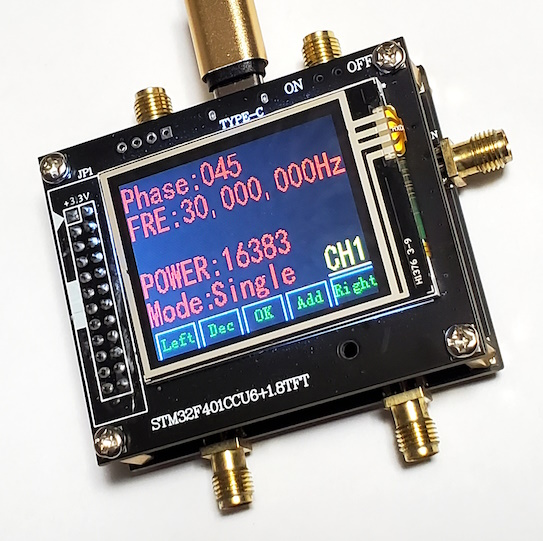
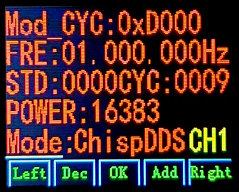
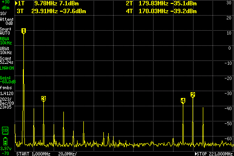

# AD9106 Arbitrary Waveform Generator


# Overview 

This document discusses a particular Arbitrary Waveform Generator (AWG) that is based on the AD9106 chip by Analog Devices.  While the chip itself has documentation located at [https://www.analog.com/en/products/ad9106.html](https://www.analog.com/en/products/ad9106.html), the documentation for the AWG device is scant.



The device does not appear to have a canonical name.  Below are example names it is sold under on [Aliexpress](https://www.aliexpress.us) and/or [eBay](https://www.ebay.com):
- AD9106 4-Channel Arbitrary Waveform Generator 12Bit 180MSPS + STM32 Touch LCD
- AD9106 4-channel DAC low-power, DDS 12-bit, 180 MSPS digital-to-analog converter and waveform generator
- AD9106 4CH Arbitrary Waveform Generator 12Bit 180MSPS + Master Control Board sup
- AD9106 4CH Arbitrary Waveform Generator 12Bit 180MSPS + STM32 Control Board TPS
- AD9106 Four-channel12-bit 180MSPS digital-to-analog converter waveform generator
- AD9106 Four-channel DAC Low-power, DDS 12-bit /180 MSPS Digital-to-analog Converter and Waveform Generator

Topics covered include how to manually operate the AWG device via its touch screen, its output, its USB communication, and other details.

The maximum frequencies for the AWG are:
- 30MHz for sine 
- ~11KHz for sawtooth up/down
- ~5.5KHz for triangle
- Maximum frequency for arbitrary waveforms varies according to the length of the data in SRAM, but when the entire 4K SRAM is used then the frequency is 43.94 KHz

Note that the AWG device exposes many, but not all possible features, of the AD9106 chip.

As of firmware 1.1, some notable features not exposed are:
- adjustable DC voltage offsets
- ability to add CH3 to CH1's output and CH4 to CH2's output
- creation of arbitrary waveforms via the device's touch screen, though there are 3 pre-stored waveforms available via the touch screen and arbitrary data can be uploaded over USB


# Manual Operation


## Switches and Connectors

There is a tiny On/Off switch on the top right edge of the top board.

The AWG has 5 SMA connectors.

Four of the SMA connectors labeled as OUT1 through OUT4 are outputs connectors for the generated signals.  These connectors expect to be 50 Ohm terminated.  The complete voltage range is 1.6 Vpp centered at 0V (i.e., -0.8V to 0.8V) though this range is reduced at high frequencies.  One mode, the noise ("Nosie"), is limited to a range of 0V to 0.1V.

The 5th SMA connector is the CLK_IN connector.  Despite its name, by default it is an *output* of the 180 MHz crystal oscillator on the bottom board with a voltage range of 0.56V to 1.30V while *unterminated*.  If output is 50 Ohm terminated, the AWG stops operating.  The CLK_IN becomes an *input* if pin 1 of the 180 MHz crystal oscillator on the bottom board is grounded.  When inputting an external clock, the bottom board has 50 Ohm termination.  Pin 1 is the upper-right of the of the oscillator when looking down at the AWG normally.

The AWG also has a USB-C connector for power and communication.


## User Interface

The main user interface has 5 touch screen buttons at the bottom edge of the screen.  These are used to change values, switch between controlling each of the 4 channels, and change between the 7 different output modes per each channel.  The rest of the screen displays values and is not used for touch input.

The 5 buttons are:
- `Left` & `Right` are used for moving the cursor around the screen.
- `Add` & `Dec` increase or decrease the value were the cursor is located.
- `OK` is used to activate the output mode displayed on the screen after switching to a new mode.  This button is not needed when changing values for the active output mode.


### Summary of Modes and Settings
There are 7 output modes that are individually settable per channel.  In summary, they are:

Mode Name   | Summary
------------|--------------
Signal      | Sine wave
Sawtooth    | Sawtooth up, sawtooth down, or triangle wave
Nosie       | Noise signal (on-screen text is misspelled)
Random      | Arbitrary waveform from SRAM, *not random*
ChispSAW    | Partial or full single cycle of a sawtooth or triangle wave in a Mod CYC period
ChispDDS    | CYC number of sine waves in a Mod CYC period
RAM Modu    | Sine wave that is AM modulated by SRAM data

Each output mode is altered by various on-screen settings.  The table below lists all settings, what register or field they relate to on the AD9106 chip, whether the setting is global across all outputs or a per output setting, and general descriptions.

Setting   | Register       | Range           | Effect     | Comment
----------|----------------|-----------------|------------|--------
Frequency | DDSTW          | 0 Hz - 30 MHz   | global     | Sine wave frequency, output is limited to 10.73 Hz increments
Phase     | DDSx_PHASE     | 0 - 360         | per output | Phase of the sine wave in degrees
Power     | DACx_DIG_GAIN  | 0 - 16383       | per output | Amplitude of the wave's voltage (not power), values are linear, max is +/- 0.8 V except for Noise mode
S         | SAW_TYPEx      | UP, DW, TR, NOP | per output | Whether to perform sawtooth up, sawtooth down, triangle, or no waveform
SAWC      | SAW_STEPx      | 6 bits          | per output | Period of sawtooth or triangle wave.  Only 64 values (see below)
SRAM      | SRAM           | 0 - 2           | global     | Which of 3 predefined waveforms to fill SRAM with (see below)
SA        | START_ADDRx    | 0000 - ffff     | per output | Starting address to use for SRAM data, value is 0-based
SP        | STOP_ADDRx     | 0000 - ffff     | per output | Ending address to use for SRAM data, value is 0-based
Mod CYC   | PATTERN_PERIOD | 0000 - ffff     | global     | Length of Pattern Period in 180 MHz clock ticks
STD       | START_DELAYx   | 0000 - ffff     | per output | Number of 180 MHz clock ticks to delay starting the waveform in a Pattern Period
CYC       | DDS_CYCx       | 0000 - ffff     | per output | Number of sine, sawtooth, triangle wave cycles to perform during a Pattern Period

Extended comments:
- Frequency is rounded *down* to the nearest multiple of 10.73 Hz.  Thus, if the on-screen setting is 21 Hz then the output is actually 10.73 Hz while 22 Hz on-screen generates 21.46 Hz output.
- SAWC is displayed as 6 bits instead of as a decimal value of 0-63.  For sawtooth up and down, the waveform's period is SAWC \* 91.0 usec, or more precisely is SAWC \* 16384 / (180 MHz).  The exception is that SAWC = 0 acts as the value 64, thus the period is 5.825 msec.  For triangle, the period is 2x as long.
- SRAM predefined waveforms are sum of 1, 2, or 3 sine waves, respectively.  Variable x ranges from 0 to 360 degrees but in 4096 increments to produce 1 full cycle that fills the AD9106's SRAM.
    - SRAM 0 is the formula $`sin(x)`$
    - SRAM 1 is the formula $`sin(x) + sin(2x)`$
    - SRAM 2 is the formula $`sin(x) + sin(2x) + sin(3x)`$
- The SA and SP values are 16-bit values but only the top 12-bits are used.  Thus, SA and SP are the start and stop sample numbers multiplied by 16 (aka, left shifted by 4 bits).  To playback the entire SRAM contents without any added pauses, set SA to 0000, SP to FFFF, and Mod CYC to 0x1000.
- Mod CYC defines the pattern period, which is (Mod CYC) / (180 MHz).  For example, if Mod CYC is 0x1000, then the period is 22.7555 usec or 43.945 KHz.
- Odd behavior has been observed when some setting are set to 0, when the STD (start delay) is longer than the Pattern Period, and other unusual settings.
- Most of the settings that affect each mode are displayed on their respective screens.  However, a handful of settings from one mode can affect another mode.  For example, Phase can be set in one mode and affect ChispDDS mode.


### Signal Mode

- Output: sine wave
- On-screen settings: Power, Phase, Frequency
- AD9106 register fields: WAV_SELx = 1, PRESTORE_SELx = 3

1 MHz sine example (with Phase = 0 and Power = 16383):


30 MHz sine example (with Phase = 0 and Power = 16383); note the attenuation and 180 MHz noise:


### Sawtooth Mode

- Output: sawtooth up, sawtooth down, or triangle wave
- On-screen settings: Power, SAWC, S
- AD9106 register fields: WAV_SELx = 1, PRESTORE_SELx = 1

Sawtooth Up example (with SAWC = 000001 and Power = 16383).


Sawtooth Down example (with SAWC = 000001 and Power = 16383).


Sawtooth Up example (with SAWC = 000001 and Power = 16383).


### Nosie Mode

- Output: output a noise signal (note that on-screen text is misspelled)
- On-screen settings: Power
- AD9106 register fields: WAV_SELx = 1, PRESTORE_SELx = 2

Noise example using wide time range, repeatedly rising-edge triggered, and noisier CH1 (with Power 16383):


Noise example using narrow time range, repeatedly rising-edge triggered, and noisier CH1 (with Power 16383):


Noise example using narrow time range, single-shot triggered, and noisier CH1 (with Power 16383):


Noise example using wide time range, repeatedly rising-edge triggered, and quieter CH3 (with Power 16383):


Noise example using narrow time range, repeatedly rising-edge triggered, and quieter CH3 (with Power 16383):


Noise example using narrow time range, single-shot triggered, and quieter CH3 (with Power 16383):


### Random Mode

- Output: arbitrary waveform, *not random data*
- On-screen settings: Power, SRAM, SA, SP, Mod CYC
- AD9106 register fields: WAV_SELx = 0

SRAM waveform 0 example (with Mod_CYC = 0x2000 to be 2x the length of the entire SRAM waveform, SA = 0x0000 and SP = 0xFFFF to playback the entire SRAM waveform, Power = 16383):


SRAM waveform 1 (with Mod_CYC = 0x2000 to be 2x the length of the entire SRAM waveform, SA = 0x0000 and SP = 0xFFFF to playback the entire SRAM waveform, Power = 16383):


SRAM waveform 2 (with Mod_CYC = 0x2000 to be 2x the length of the entire SRAM waveform, SA = 0x0000 and SP = 0xFFFF to playback the entire SRAM waveform, Power = 16383):


### ChispSAW Mode

- Output: partial or full single cycle of a sawtooth or triangle wave in a Mod CYC period
- On-screen settings: Power, S, SAWC, CYC, STD, Mod CYC
- AD9106 register fields: WAV_SELx = 2, PRESTORE_SELx = 1
- Tip: use STD to set the initial output level's time duration, sawtooth up or down to transition to the final output level, and the remaining time in Mod CYC to hold the final output level.

ChispSAW Sawtooth UP with STD delay = 0x0000 example (with Mod CYC 0xFFFF, SAWC 000001, CYC 0x0000, Power 16383):


Sawtooth UP with STD delay = 0x2000 example (with Mod CYC 0xFFFF, SAWC 000001, CYC 0x0000, Power 16383):


### ChispDDS Mode

- Output: CYC number of sine waves in a Mod CYC period
- On-screen settings: Power, Frequency, CYC, STD, Mod CYC
- AD9106 register fields: WAV_SELx = 2, PRESTORE_SELx = 3
    
4 cycles of 1MHz sine wave example (with Mod CYC = 0x0400, STD = 0x0000, Power 16383):


### RAM Modu Mode

- Output: sine wave that is AM modulated by SRAM data
- On-screen settings: Power, Frequency, SRAM, Mod CYC
- *Off-screen settings: CYC (this must be set beforehand in a ChispSAW or ChispDDS mode)*
- AD9106 register fields: WAV_SELx = 3

7 RAM Modu for SRAM 0, 1, 2.  CYC 0x0020 (set in another mode), Frequency 1 MHz, Mod CYC 0x2000, Power 16383

SRAM 0 AM modulation of 1MHz sine wave example (with Mod CYC = 0x2000, Power = 16383, and CYC = 0x0020 but set in a different mode):


SRAM 1 AM modulation of 1MHz sine wave example (with Mod CYC = 0x2000, Power = 16383, and CYC = 0x0020 but set in a different mode):


SRAM 2 AM modulation of 1MHz sine wave example (with Mod CYC = 0x2000, Power = 16383, and CYC = 0x0020 but set in a different mode):


# Output

## Performance Characteristics

Measured sine wave output in volts peak-to-peak and mV RMS for various frequency settings.  Phase setting was 0.  Power setting was 16383.


<BR/>
Measured sine wave output in volts peak-to-peak and mV RMS for various power settings.  Phase setting was 0.  Frequency was set to 30 MHz (blue data) and 1 MHz (orange data).  Note that the actual maximum Power setting is 16383; the graph shows 16384 as the maximum due to rendering limitations.


<BR/>
Comparison graphs of the Frequency setting to output frequency as a percentage of the input Frequency setting.  For example, if Frequency setting is set to 21 Hz, then the actual output frequency is 10.73 Hz which is 51.1% of the input Frequency setting.  The first graph shows a few select values from actual measurements.  Phase setting was 0.  Power setting was 16383.  The second graph is a plot of all Frequency settings using a computed formula, not measurements.


<BR/>
Measured noise output in volts peak-to-peak and mV RMS for various frequency settings.  The graph does not intersect with 0 volts when set to 0 Power due to the noise floor.


## Signal Noise

Spectral analysis of sine wave output on CH1, using Signal Mode with Power setting of 16383, for 5, 10, 20, and 30 MHz frequencies.  60 dB attenuation used to avoid clipping by the spectrum analyzer.  Notes:

- Observer the -35 dBm of 180 MHz noise and the 2 neighboring harmonics.
- The MHz readings for the peaks are only accurate to +/- a few 100 kHz due to horizontal screen resolution.
- The below were measured *without* the use of a Faraday cage.  Thus some external signals may have leaked into the circuit, such a 94.9 FM radio station.





<BR/>
The various channels have a different amount of inherent noise.  The following inherent noise measurements from one AWG device when no waveform was output, specifically a sine wave of 0 Hz and Power setting of 0.  No attenuators were used.

- CH1: 14.0 mVpp (range -1.9 to 13.0 mV).  It has frequency components primarily at 180 MHz.
- CH2: 10.2 mVpp (range -4.3 to  5.9 mV).  It has frequency components primarily at 14.82 MHz, 180 MHz, 9.88 MHz, as well as a large number of odd harmonics of 365 KHz.
- CH3:  5.0 mVpp (range -8.0 to -3.0 mV).  It has frequency components primarily at 180 MHz.
- CH4:  4.8 mVpp (range -1.0 to  3.8 mV).  It has frequency components primarily at 180 MHz.

AC coupled inherent noise, displayed with 20 mV DC offsets, on a narrow time base:


AC coupled inherent noise, displayed with 20 mV DC offsets, on a wide time base:


Spectral analysis of the above inherent noise was performed for CH1 thru CH4.  A lower noise floor was possible here when compared to the prior sine wave output spectral analysis (i.e., the dBm scale on the right side shifted to lower values).


# USB communication

## Drivers

In theory, the AN9106 AWG operates as USB serial device.  It shows up as COM port or as a tty, depending on the operating system.

On Windows 10, the built-in drivers should automatically load.  However, some uses have reported issues.  In this case, download STMicroelectronics Virtual COM Port driver designed for Windows 8 and use Windows Device Manager to force these drivers to be used instead.

## Protocol

Documentation for the protocol has been mostly determined by translating the documentation from Chinese to English.  Both versions of the documentation are available in the `manuals` directory of the repository.

Broad properties are:

- It is an ASCII protocol that requires a line-ending of CR+LF (i.e., two bytes of 0D 0A, alternatively as CTRL+M followed by CTRL+J)
- Commands are case-sensitive
- There is no remote echo (i.e., device does not echo back what was typed)
- Most commands do not generate a response of any kind.  The only exceptions are the `XXX` and `OVER` commands.
- Commands that set values update the device's screen immediately.

The following commands are documented:

- `XXX`
    - Description: retrieve all the device's current Settings.  The response is described later but to summarize, it is a list of the most of commands with their values, a series of numbers for a few specific commands, and ends with the word `OVER`.
    - Example: `XXX`
- `CHANNEL` + value
    - Description: sets the currently displayed channel.
    - Example: `CHANNEL4` sets CH4 to be displayed
- `MOD` + channel + value
    - Description: sets a channel's mode (i.e., to Signal, Sawtooth, ChispDDS, etc.).  Valid values range from 1 - 7, corresponding to the modes Signal thru RAM Modu, respectively.
    - Example: `MOD24` sets CH2 to mode 4
- `FREQ` + value
    - Description: set the sine wave frequency in Hz
    - Example: `FREQ1150` to set the frequency to 11.5 KHz
- `PHS` + channel + value
    - Description: set the phase for a channel in degrees
    - Example: `PHS2120` sets CH2 to 120 degrees
- `AMP` + channel + value
    - Description: set voltage amplitude for a channel (i.e., the "Power" setting)
    - Example: `AMP311000` sets CH3 to an amplitude of 11000
- `STE` + channel + value
    - Description: set channel to sawtooth up, down, triangle, or nop (i.e., the "S" setting) using values 0 - 3, respectively.
    - Example: `STE12` sets CH1 to sawtooth waveform 2
- `SAW` + channel + value
    - Description: sets the sawtooth or triangle period for a channel (i.e., the "SAWC" setting).  Valid values are 0 - 63
    - Example: `SAW232` sets CH2 to a value of 32
- `SRAM` + value
    - Description: sets SRAM to one of the predefined waveforms of 0 - 2
    - Example: `SRAM1` sets the SRAM to waveform 1
- `STA` + channel + value
    - Description: sets a channel's SRAM starting address (i.e., the "SA" setting)
    - Example: `STA40000` sets channel CH4 to 0x0000 starting address
- `STP` + channel + value
    - Description: sets a channel's SRAM stopping address (i.e., the "SP" setting)
    - Example: `STP4FFFF` sets channel CH4 to 0xFFFF stopping address
- `YCYM` + value
    - Description: sets the pattern period (i.e. the "Mod CYC" setting).  Documentation spells this as YCYM, not the expected CYCM.
    - Example: `YCYMF000` sets the pattern period to 0xF000
- `STD` + channel + value
    - Description: sets a channel's start delay
    - Example: `STD20001` sets CH2 to have a start delay of 1
- `YCC` + channel + value
    - Description: sets how many sine wave cycles occur during a Mod CYC (i.e., the "CYC" setting).  Documentation spells this as YCC, not the expected CYC.
    - Example: `YCC30010` sets CH3 to have 10 sine wave cycles
- `OVER`
    - Description: causes the device to respond with an `OVER`, likely intended as a ping command.
    - Example: `OVER`

An example response for `XXX` is:

```
POWER:16383
Phase:000
SAWC:000001
SA:0000
SP:FFFF
STD:0000
CYC:0020
POWER:16383
Phase:000
SAWC:000000
SA:0000
SP:FFFF
STD:0000
CYC:000B
POWER:00000
Phase:000
SAWC:000000
SA:0000
SP:0000
STD:0000
CYC:0000
POWER:00000
Phase:000
SAWC:000001
SA:0000
SP:FFFF
STD:6000
CYC:0001
FRE:00,000,000Hz
Mod_CYC:0x1000
0200141101
OVER
```

The format is described below.  Parenthesis indicate the corresponding command that sets the value in the response, when it differs from the response.

- 4 sections corresponding to CH1 thru CH4 with the current values for each channel.  The values are: POWER (AMP), Phase (PHS), SAWC (SAW), SA (STA), SP (STP), STD, and CYC (YCC)
- A section for the global values of: FRE (FREQ), Mod_CYC (YCYM)
- A 10 digit number where:
    - Digits 1-4 are each channel's S (STE) value
    - Digits 5-8 are each channel's mode (MOD)
    - Digit 9 is the global SRAM value
    - Digit 10 is the currently displayed channel where values 0 - 3 correspond to CH1 - CH4.  In contrast, setting this value is done using CHANNEL1 - CHANNEL4, respectively.
- `OVER` is output, but it is not terminated by CR+LF

## Unknowns

The software supports uploading arbitrary waveform data to the device.  Unfortunately, this mechanism is not yet known.  A screenshot of the application show the following:

- A transmission of `1511511511511511...511511511511511` where `...` is `511` repeating, followed by a line-break, followed by `OVER`
- A receipt of 8 `OVER` concatenated without line-breaks.  These 8 appears to be after the execution of a prior `XXX` command which results in a total of 9 `OVER`s.

What is presumed is that the software uploads the data in 8 chunks of 512 samples using an unknown command and executing `OVER` after each chunk to either confirm the upload was successful or that the device is still responsive.
